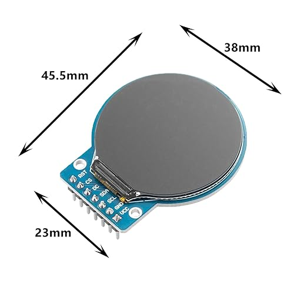

# Hardware

## PCB

The PCB was designed in EasyEDA Pro and ordered through its built-in JLCPCB
integration. Five boards cost me about $70 including tax and shipping, two of
them fully assembled with all parts. I picked the components so that JLCPCB's
cheaper Economic PCBA option is enough.

## Mounting plate

The 3D model is straightforward: print it in any black material you like — ABS
worked for me.

## Additional parts

- **Screws** — I just reused the ones from the Reachy Mini.
- **USB-C cable** to connect the PCB to the board -I used [these](https://www.amazon.de/dp/B0FMRND1BQ)
- **Two GC9A01 1.28" round displays** — I used
  [these](https://www.amazon.de/kreisf%C3%B6rmiger-TFT-Bildschirm-Schnittstelle-Echtzeit%C3%BCberwachung-Instrumentenanzeige/dp/B0DB5MR27T/).
  They should look like this:

  

## Getting it running

### Flash and test the PCB

Do this **before** taking the robot apart — it is much easier to debug a board
sitting on your desk than one buried in the head.

1. Plug both displays into the PCB.
2. Connect the PCB to your computer and flash the firmware (see
   [`../esp32/README.md`](../esp32/README.md)).
3. The board should boot straight into idle mode, showing both eyes wandering
   and blinking.

Only continue once you see the eyes moving.

### Assembly

Take your time here, and be careful with the flat cables — they are fragile and
easy to tear.

1. Open the front of the head, minding the camera cable.
2. Unplug the camera cable from the camera module.
3. Unscrew the camera module from the original mounting plate.
4. Unscrew the original mounting plate that holds the stock eyes.
5. Screw the camera module onto the new mounting plate.
6. Push the displays into the new mounting plate.
7. Reconnect the camera cable.
8. Plug the PCB onto the display headers and screw it to the mounting plate.
9. Connect the USB cable to the head and to the PCB.
10. Gently push the modified faceplate back onto the head, watching the
    microphone cable and taking care not to damage the camera cable. If anything
    resists, stop and find out why before pushing further.
11. Screw everything back together.
